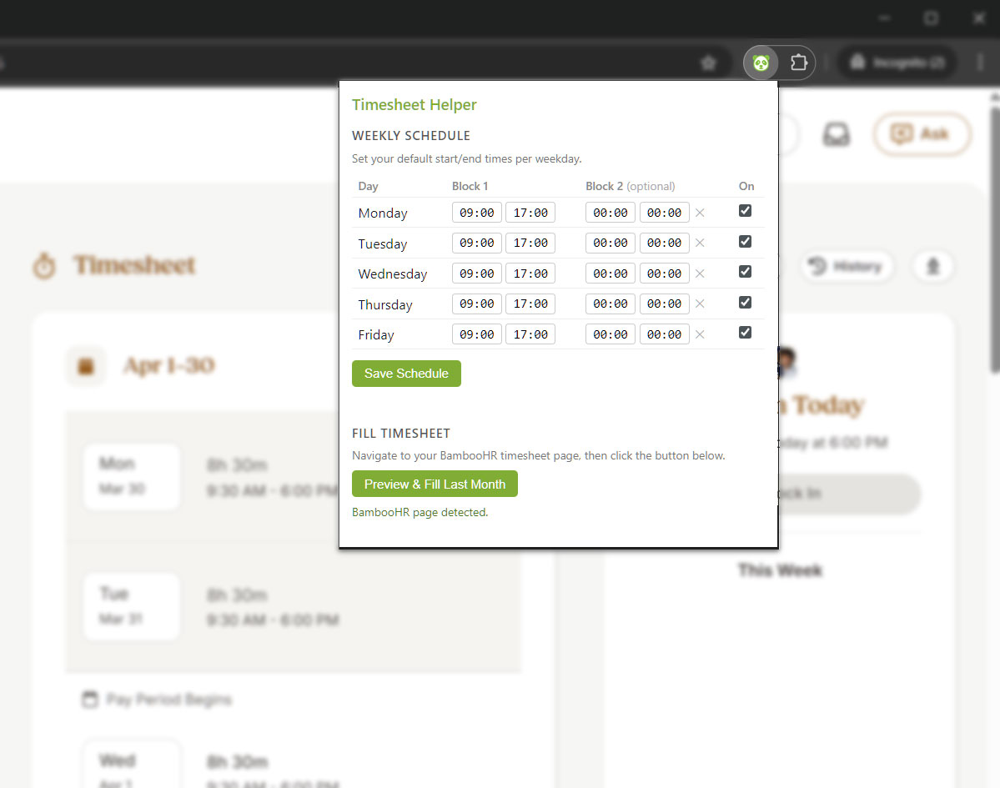

# AZ BambooHR Timesheet Helper

A Chrome extension that auto-fills your BambooHR timesheet for the past month based on a saved weekly schedule template — so you never have to click through each day manually. 
<b>Disclaimer:</b> This project is vibe coded.

## Features

- Define a reusable weekly schedule (Mon–Fri) with up to two time blocks per day (e.g. morning + afternoon)
- Preview entries before submitting — see what will be filled, what already exists, and what days are skipped
- Automatically skips days that already have entries, holidays, and vacation days
- Persists your schedule across sessions via Chrome storage

## Installation

No build step required. Edit the source files directly and reload the extension in `chrome://extensions` after changes.

This extension is not published to the Chrome Web Store. Install it as an unpacked extension:

1. Clone or download this repository
2. Open Chrome and go to `chrome://extensions`
3. Enable **Developer mode** (top-right toggle)
4. Click **Load unpacked** and select the project folder
5. The extension icon will appear in your toolbar

## Usage

1. Navigate to your BambooHR timesheet page (must be on `*.bamboohr.com`)
2. Click the extension icon in your toolbar
3. Set your weekly schedule — configure start/end times for each day, optionally add a second time block, and uncheck any days you don't work
4. Click **Save Schedule**
5. Click **Fill Timesheet** to open a preview of the entries that will be created
6. Review the preview and confirm to submit

## Schedule Format

Each weekday has two configurable time blocks:

| Field | Format | Example |
|-------|--------|---------|
| Start | `HH:MM` (24h) | `09:00` |
| End | `HH:MM` (24h) | `17:30` |

Set a block to `00:00 – 00:00` (or click the ✕ button) to leave it empty. Uncheck a day to skip it entirely.

## Permissions

| Permission | Reason |
|------------|--------|
| `activeTab` | Detect the current BambooHR tab |
| `scripting` | Inject the content script to read and fill the timesheet |
| `storage` | Persist your weekly schedule locally |
| `https://*.bamboohr.com/*` | Restrict all access to BambooHR pages only |

